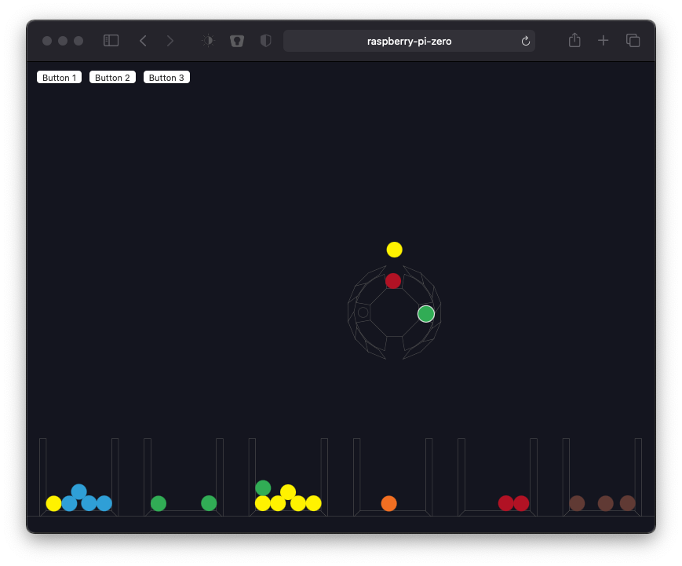
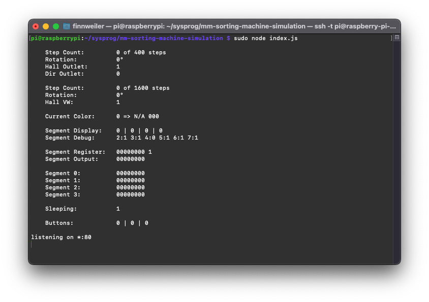

# mm-sorting-machine-simulation


## Installation

update & upgrade:

1. `sudo apt-get update`
2. `sudo apt-get dist-upgrade`

install node:

3. `curl -sL https://deb.nodesource.com/setup_14.x | sudo -E bash -`
4. `sudo apt-get install -y nodejs`

check if node is installed:

5. `node -v`

clone the github repo:

6. `git clone git@github.com:hans24o/mm-sorting-machine-simulation.git`

install npm dependencies:

7. `npm install`

## Run

To run the simulation:

`sudo node index.js`

You can now open your browser and enter your Raspberry Pi's hostname (for example: http://raspberry-pi-zero/)

## Demo



## Notes

If your are running the simulation of the sorting machine and your code to control it on the same pi, you need to configure the inputs to be outputs within your code. Otherwise the simulation will not be able to set the GPIO pins. Remember to change this back when you connect a physical machine.

```s
@ REVERSED INPUTS
            @Pins 9  8  7  6  5  4  3  2  1  0
ldr     r0, =#0b001001001001001001001001000000
str     r0, [GPIOREG] @Function Select Register 0 (Pin 0 - 9)

            @    19 18 17 16 15 14 13 12 11 10
ldr     r0, =#0b001000001001000000001001001001
str     r0, [GPIOREG, #4] @Function Select Register 1 (Pin 10 - 19) 

            @          27 26 25 24 23 22 21 20
ldr     r0, =#0b000000001001000001001001001001
str     r0, [GPIOREG, #8] @Function Select Register 1 (Pin 20 - 29)
```

